# Radius Demo App

This application is used to demonstrate Radius basics as part of our 'first application' tutorial.

Visit https://radapp.io to try it out.
## Architecture

> *Auto-generated from `app.bicep` — click any node to jump to its definition in the source.*

```mermaid
%%{ init: { 'theme': 'base', 'themeVariables': { 'primaryColor': '#ffffff', 'primaryTextColor': '#1f2328', 'primaryBorderColor': '#d1d9e0', 'lineColor': '#2da44e', 'secondaryColor': '#f6f8fa', 'tertiaryColor': '#ffffff', 'background': '#ffffff', 'mainBkg': '#ffffff', 'nodeBorder': '#d1d9e0', 'clusterBkg': '#f6f8fa', 'clusterBorder': '#d1d9e0', 'fontSize': '14px', 'fontFamily': '-apple-system, BlinkMacSystemFont, Segoe UI, Noto Sans, Helvetica, Arial, sans-serif' } } }%%
graph LR
    classDef container fill:#ffffff,stroke:#2da44e,stroke-width:1.5px,color:#1f2328,rx:6,ry:6
    classDef datastore fill:#ffffff,stroke:#d4a72c,stroke-width:1.5px,color:#1f2328,rx:6,ry:6
    classDef other fill:#ffffff,stroke:#d1d9e0,stroke-width:1.5px,color:#1f2328,rx:6,ry:6
    demo["<b>demo</b><br/>:3000"]:::container
    sqlDb["<b>sqlDb</b>"]:::datastore
    demo --> sqlDb
    click demo href "https://github.com/willtsai/radius-todo-app/blob/main/app.bicep#L14" "app.bicep:14" _blank
    click sqlDb href "https://github.com/willtsai/radius-todo-app/blob/main/app.bicep#L40" "app.bicep:40" _blank
    linkStyle 0 stroke:#2da44e,stroke-width:1.5px
```

